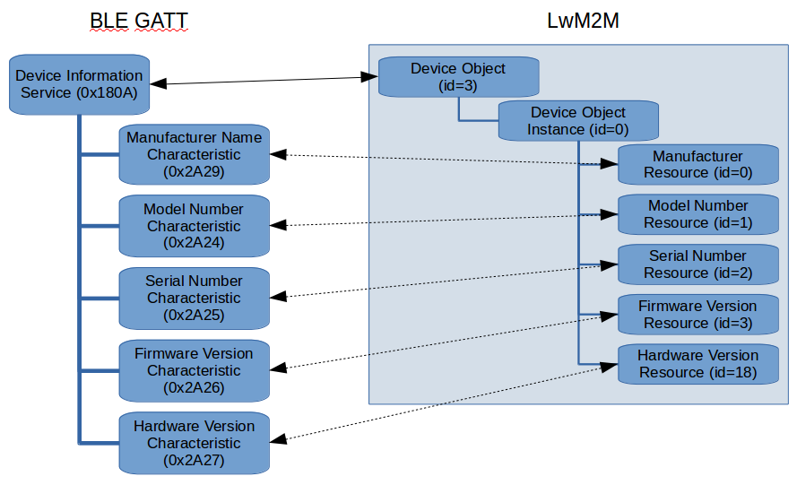
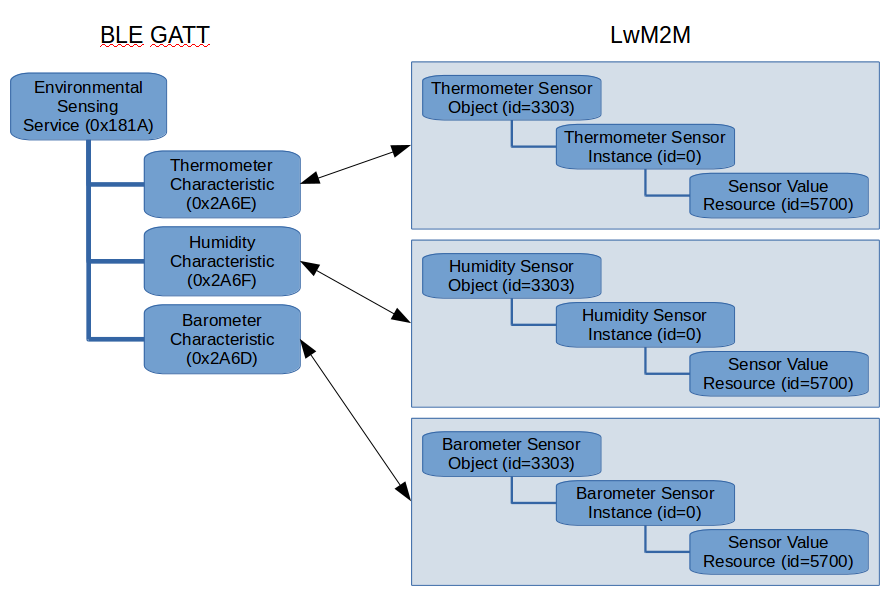

## The Bluetooth Low Energy protocol translator example

<span class="notes">**Note:** This is an example demonstrating the use of the protocol translator client. Do not use for production implementation.</span>

The `blept-example` is a protocol translator reference implementation for use with Bluetooth Low Energy (BLE) devices that implement a Bluetooth Low Energy Generic Attributes (GATT) server. It translates GATT services and characteristics into Open Mobile Alliance (OMA) Lightweight Machine to Machine (LwM2M) Objects and Resources. The reference has been designed so that adding support for new devices, services or characteristics that follow the GATT standard requires minimal code changes.

### Prerequisites

- BlueZ daemon version 5.48.
- Any Bluetooth Low Energy device implementing a GATT server works provided it supports the "Just works" pairing method where no pin code needs to be shared. The protocol translator was tested with the following applications and devices:
    - Silicon Labs ThunderBoard Sense with the default firmware.
    - Android phone running the Nordic Semiconductor nRF Connect application. Note: When the protocol translator first connects the phone might ask permission to pair.

### Operation description

The reference implementation uses BlueZ Bluetooth daemon to implement Bluetooth connectivity. The protocol translator implements a DBus client by using the GLib library. The DBus client accesses the BlueZ DBus API. The GLib event loop is used to synchronise access to the shared data between the DBus client and the protocol translator callbacks by moving the callback logic into GLib events. Additionally, the GLib event loop is used to schedule periodic characteristic value polling.

Only connectable and pairable devices are supported. Device discovery is done continuously using active scanning. Two device discovery modes are implemented:

1. Default mode (May be disabled using Extended discovery mode).
2. Extended discovery mode (`--extended-discovery-file <file-path>`).

In the default mode the devices are identified only based on the primary services they advertise. The default mode is disabled if the extended discovery mode is used. For the device to be identified in default mode, it must advertise one of the services defined in the `ble_services` array (see [pt_ble_supported_translations.c](pt_ble_supported_translations.c)).

In the extended discovery mode additional logic can be implemented to identify devices that don't advertise their services. Currently extended discovery is done based on a JSON configuration file containing a whitelist in which the user may add either full match or partial match device name patterns. The file name can be given using the `--extended-discovery-file` command-line parameter. For more information, see the documentation in `blept_example.docopt` or the command-line help using `blept-example --help`.

The device will be connected when it's identified either using the default or the extended discovery mode.

When a connection is initiated, the GATT service discovery is performed by the BlueZ daemon. After service discovery has finished the LwM2M resources are created in the protocol translator. A service object (id 18135) instance is created for each service and a resource is created for each characteristic belonging to that service. A mapping from the service object resources to the characteristic is added to JSON introspection resource /18131/0/0. Additionally a translation into specific supported LwM2M objects and resources is done based on a static translation table according to the 128-bit Universally Unique Identifier (UUID) for the service or characteristic. After the service translation has been instantiated the device is registered and it appears in the Device Management. Characteristic values for all registered devices are polled with a 5 second interval. You can configure the interval with the `BLE_VALUE_READ_INTERVAL` macro. See [pt_ble.c](pt_ble.c) for more information.

### GATT service and characteristic translation

Services and characteristics are translated based on a translation table that describes what services are supported and how each service and the characteristics within it are translated. The translation table is a list of service descriptor structures (see [Service descriptor](#service-descriptor)) that describe how each service is translated. Each service descriptor structure can also contain a list of characteristic descriptor structures (see [Characteristic descriptor](#characteristic-descriptor)) that describe how each characteristic is translated.

When BlueZ daemon has resolved the GATT services of a connected device, the protocol translator will iterate over each service and search for a service descriptor with matching UUID in the `ble_services` table. If a service descriptor with matching UUID is found, the `service_construct` function pointer is called. The constructor function instantiates the relevant LwM2M instances for the device that is passed in with the `ble_device` structure parameter. For more information on the structure, see `devices.h`. For more information how the LwM2M instances are created see `include/pt-client/pt_api.h` in the mbed-edge repository.

You can leave `service_construct` as NULL, in which case a default service constructor function is called. The default service constructor will iterate over the service's characteristics and search for the characteristic descriptor with a matching UUID in the `characteristics` table of the service descriptor. If the `characteristics` table is also NULL, only the service object will be created and no specific translation is instantiated.

If a matching characteristic descriptor is found, the `characteristic_construct` function pointer is called and the function instantiates the relevant LwM2M instances for the device that is passed in with the `ble_device` structure parameter.

#### Service descriptor

The service descriptor structure (see `struct ble_service` in [pt_ble_translations.h](pt_ble_translations.h)) describes how the protocol translator should translate a specific service and its characteristics. The service descriptor consists of:
- `uuid` Bluetooth GATT service 128-bit UUID as a string.
- `service_construct` A service constructor function pointer used to construct the LwM2M Objects and Resources in the protocol translator to represent this service.
- `characteristic_count` Number of supported characteristics.
- `characteristics` Table of supported characteristic descriptors.

#### Characteristic descriptor

The characteristic descriptor structure (see `struct ble_characteristic` in [pt_ble_translations.h](pt_ble_translations.h)) describes how the protocol translator should translate a specific characteristic. Each characteristic descriptor consists of:
- `uuid` The Bluetooth GATT characteristic 128-bit UUID as a string.
- `characteristic_construct` A characteristic constructor function pointer used to construct the required LwM2M Objects and Resources in the protocol translator.
- `characteristic_value_decode` A characteristic value decoder function pointer used to decode the Bluetooth GATT characteristic value format into the protocol translator LwM2M Resource value format.
- `characteristic_value_encode` A characteristic value encoder function pointer used to encode the protocol translator LwM2M Resource value format into the Bluetooth GATT characteristic value format.
- `value_format_descriptor` An additional descriptor which describes the value format of the Bluetooth GATT characteristic value.

#### Adding new services and characteristics

You can add a new service by including a new service descriptor in the `ble_services` table in [pt_ble_supported_translations.c](pt_ble_supported_translations.c). The UUID field is always mandatory. There are two ways you can instantiate a service translation: instantiating only a service-specific translation and instantiating only characteristic translations.

**Instantiating only a service-specific translation**

Instantiate only a service-specific translation by defining and implementing the service constructor function and leaving the characteristics table empty (NULL and zero size).

Typically you would do this if you want to represent a service's characteristics as LwM2M Resources in a single Object Instance, for example. In the constructor function, you create the relevant LwM2M Object and Object instance to represent the service and the LwM2M Resources to represent the characteristics. See [Instantiating translations](#instantiating-translations) for reference how translations should be instantiated.

As an example, consider the Device Information Service translation (see figure and code snippet below). The service is represented as the LwM2M Device Object and the relevant characteristics are translated as Device Object Resources. In this case, only the service constructor (see `ble_services_construct_dis_service` function in [pt_ble_supported_translations.c](pt_ble_supported_translations.c) is invoked and it creates the Device Object (id 3) and Resources, for example the Manufacturer Name characteristic (GATT UUID 0x2A29) is translated into the Device Object's Manufacturer Resource (id 0).

```c
// Define device reboot callback
pt_status_t reboot_callback(const connection_id_t connection_id,
                            const char *device_id,
                            const uint16_t object_id,
                            const uint16_t object_instance_id,
                            const uint16_t resource_id,
                            const uint8_t operation,
                            const uint8_t *value,
                            const uint32_t size,
                            void *userdata)
{
    printf("Reboot requested for device %s", device_id);
    return PT_STATUS_SUCCESS;
}

// Define constructor function for Device Information Service
bool construct_dis_service(struct ble_device *device,
                           const int sv_idx,
                           const ble_service_t *service_descriptor)
{
    uint8_t manufacturer[128];
    // Loop each characteristic that belongs to the DIS service
    for (int i = 0; i < device->attrs.services[sv_idx].chars_count; i++) {
        size_t buf_size = 128;
        // Get pointer to the characteristic instance structure
        struct ble_gatt_char *ch = &device->attrs.services[sv_idx].chars[i];
        // Pointer to the characteristic UUID
        char *characteristic_uuid = ch->uuid;
        // Manufacturer characteristic (LwM2M URI /3/0/0)
        if (strcasecmp(characteristic_uuid, "00002A29-0000-1000-8000-00805F9B34FB") == 0) {
            if (ble_read_characteristic(ch->dbus_path, manufacturer, &buf_size) == 0) {
                pt_device_add_resource(edge_get_connection_id(),
                                       device->device_id,
                                       3, 0, 0,
                                       LWM2M_STRING,
                                       OPERATION_READ,
                                       strdup(manufacturer),
                                       strlen(manufacturer),
                                       free);
            }
        }
        /*
        Translate other characteristics
        else if (strcasecmp(characteristic_uuid, "..."
        */
    }
    return true;
}

// Define the service translation table with the DIS constructor
const ble_service_t ble_services[] =
{
    {.uuid = "0000180A-0000-1000-8000-00805F9B34FB",
     .service_construct = construct_dis_service,
     .characteristic_count = 0,
     .characteristics = NULL}
};
```



**Instantiating only characteristic translations**

Instantiate only characteristic translations. In this method the service constructor is left NULL and the individual characteristic descriptors are defined.

Typically you would use this when the characteristics would be translated into separate LwM2M Objects or Object Instances rather than Resources. See [Instantiating translations](#instantiating-translations) for reference how translations should be instantiated.

As an example, consider the environmental sensing service translation (see figure and code snippet below). The service itself does not have much information that we'd like to represent, rather the information is in the different sensor characteristics that can be represented as LwM2M sensor Objects. For example, we'd like the thermometer characteristic (GATT UUID 0x2A6E) to be translated into a temperature sensor Object (id 3303) and the temperature value to be represented as the sensor value Resource (id 5700).

```c
bool construct_temperature_characteristic(struct ble_device *device,
                                          const int sv_idx,
                                          const int ch_idx,
                                          const ble_characteristic_t *ble_characteristic)
{
    // Get handles to the service and characteristic instance structures
    const struct ble_gatt_service *service = &device->attrs.services[sv_idx];
    const struct ble_gatt_char *characteristic = &service->chars[ch_idx];

    // We are creating a new temperature sensor object instance (object id 3303), so get the next free instance id
    int32_t instance_id = pt_device_get_next_free_object_instance_id(edge_get_connection_id(),
                                                                     device->device_id,
                                                                     3303);

    // Prepare the sensor value buffer
    uint8_t *sensor_data = malloc(sizeof(float));
    convert_float_value_to_network_byte_order(0.0, sensor_data);

    // Create the sensor value resource (resource id 5700)
    pt_device_add_resource(edge_get_connection_id(),
                           device->device_id,
                           3303, instance_id, 5700,
                           LWM2M_FLOAT,
                           OPERATION_READ,
                           sensor_data,
                           sizeof(float),
                           free);

    // Configure translation mapping between the created LwM2M resource and the specific characteristic
    ble_services_configure_translation_context(device, sv_idx, ch_idx, 3303, instance_id, 5700, 0);

    return true;
}

// Define function that will decode temperature characteristic value into LwM2M representation
bool decode_temperature_value(const struct ble_device *device,
                              const struct translation_context *ctx,
                              const uint8_t *value_buffer_in,
                              const size_t value_size,
                              uint8_t **value_out,
                              size_t *value_out_len)
{
    // This expects that the value is in temperature characteristic value format.
    // (see Bluetooth GATT specification for Temperature characteristic (0x2A6E))
    // Ie. Decimal sint16 where exponent is -2, so a value of 2300 should result in float 23.00f
    int16_t value;
    memcpy(&value, value_buffer_in, sizeof(int16_t));
    float float_value = (float)value * pow(10, -2);

    uint8_t *temp_buf = malloc(sizeof(float));
    convert_float_value_to_network_byte_order(float_value, temp_buf);
    *value_out_len = sizeof(float);
    *value_out = temp_buf;
    return true;
}

// Define translation table for the Environmental Sensing Service
static const ble_characteristic_t environmental_sensing_characteristics[] =
{
    // Temperature
    {.uuid = "00002A6E-0000-1000-8000-00805F9B34FB",
     .characteristic_construct = construct_temperature_characteristic,
     .characteristic_value_decode = decode_temperature_value,
     .characteristic_value_encode = NULL
    }
}

// Define translation table with the Environmental Sensing Service
const ble_service_t ble_services[] =
{
    {.uuid = "0000181A-0000-1000-8000-00805F9B34FB",
     .service_construct = NULL,
     .characteristic_count = sizeof(environmental_sensing_characteristics) / sizeof(ble_characteristic_t),
     .characteristics = environmental_sensing_characteristics}
}

```



#### Instantiating translations

All the translations should be instantiated in the service or characteristic constructor functions. A translation usually creates one or more LwM2M Objects, Object Instances or Resources in the device defined by the `ble_device` structure that is passed in as a parameter. For simple characteristics where the value does not need to change it is enough to create the LwM2M translations.

For Resources that can change later or can be written to, you have to define an additional translation mapping by calling the `ble_services_configure_translation_context` function. This stores a mapping between specific characteristic instance and a specific Resource or Resources created, so that when the characteristic changes the corresponding Resource is updated and vice versa. Note that it is also possible that a single characteristic instance is translated into multiple Resources. In such a case, when calling the `ble_services_configure_translation_context` you can use the `characteristic_extra_flags` parameter to pass additional information how the translation should happen.

### Adding new devices

The devices to translate are identified by their advertised services or by name when using the extended discovery mode. Additional identification logic for extended discovery mode can be implemented in the `ble_identify_custom_device` function (see [pt_ble.c](pt_ble.c)). A translated device will become visible in Device Management with a name consisting of a prefix (default is `BLE` see `BLE_DEV` macro in [pt_ble.c](pt_ble.c)), the Bluetooth MAC address and a postfix (passed in as command line parameter), for example `BLE_DEV-12:34:56:78:9A:BC-postfix`.

### Running the protocol translator

Start `edge-core`:

```
$ ./edge-core
```

Start the `blept-example` and give the mandatory protocol translator name option:

```
$ ./blept-example --protocol-translator-name blept-example --endpoint-postfix -test
```

On Device Management, you will see the translated endpoints appear as new devices.

The `blept-example` supports optional command-line parameters to, for example, set the port
and hostname of Edge Core. For help, use:

```
$ ./blept-example --help
```

### Known issues

- Sometimes the BlueZ security manager gets into a state where "Just works" pairing does not work anymore. Restarting the BlueZ daemon with usually fixes the issue.
