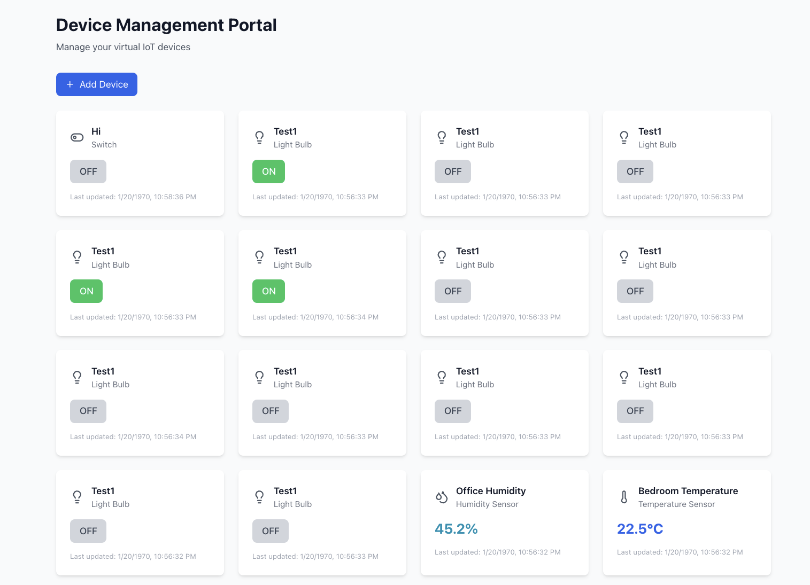

# K8s at the edge example

A comprehensive IoT device management system built with Rust, React, and Kubernetes. It will showcase [Izuma's Kubernetes at the edge features](https://developer.izumanetworks.com/docs/device-management-edge/2.6/container/index.html). You will run applications in a pod on your edge device that will communicate with each other through service discovery. You will also create config maps and persistent volume claims.

## Architecture

- **dummy-device-app**: Rust service simulating IoT devices (light bulb, switch, temperature/humidity sensor), exposes REST API to view/modify state. Stores state in PostgreSQL.
- **web-portal**: React web UI for device management with modern, responsive design
- **nginx**: Reverse proxy and load balancer for the web portal and API
- **postgres**: PostgreSQL database for persistent device state storage

## Device Types

- **Light Bulb**: `{ "on": true/false }`
- **Switch**: `{ "on": true/false }`
- **Temperature Sensor**: `{ "temperature": 22.5 }`
- **Humidity Sensor**: `{ "humidity": 44.1 }`

## Deployment

1. **Build Docker images:** Clone the repository on the device and run the following commands
```bash
# Build Rust application
cd dummy-device-app
docker build -t dummy-device-app:latest .

# Build React application
cd ../web-portal
docker build -t web-portal:latest .
```

2. **Deploy to Kubernetes:**
```bash
cd k8s

# Update the render.sh to add DeviceIDs to the variable NODE_NAMES and then run
./render.sh

# Create namespace and deploy all components
kubectl apply -f rendered/<device_id>

# Check deployment status
kubectl get pods -o wide | grep <device_id>

# Example
+ kubectl get pods -o wide
dummy-device-app-0197b36304082e89295467ae00000000   1/1     Running            2          29m     172.21.2.45   0197b36304082e89295467ae00000000   <none>
nginx-0197b36304082e89295467ae00000000              1/1     Running            0          15s     172.21.2.49   0197b36304082e89295467ae00000000   <none>
postgres-0197b36304082e89295467ae00000000           1/1     Running            0          29m     172.21.2.47   0197b36304082e89295467ae00000000   <none>
web-portal-0197b36304082e89295467ae00000000         1/1     Running            0          29m     172.21.2.46   0197b36304082e89295467ae00000000   <none>
```


