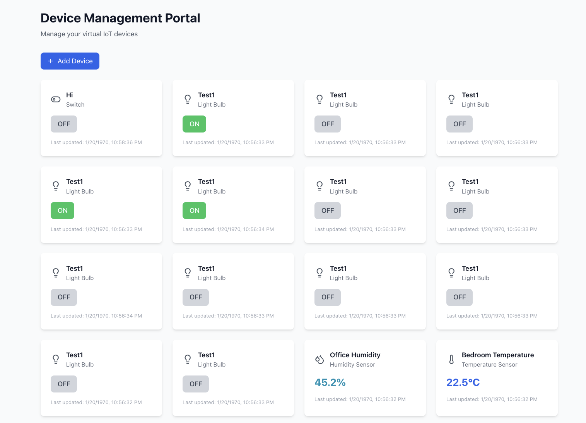

# Izuma KaaS (Kubernetes-as-a-Service) example

This example deploys a virtual IoT device management system as managed K8s containers on Izuma Edge node. You will run pods on your edge device that communicate with each other through local service discovery. This will also create config maps and persistent volume claims.

## Architecture

- **dummy-device-app**: Rust service simulating IoT devices (light bulb, switch, temperature/humidity sensor), exposes REST API to view/modify state. Stores state in PostgreSQL.
    - Supported device types
        - **Light Bulb**: `{ "on": true/false }`
        - **Switch**: `{ "on": true/false }`
        - **Temperature Sensor**: `{ "temperature": 22.5 }`
        - **Humidity Sensor**: `{ "humidity": 44.1 }`
- **web-portal**: React web UI for device management with modern, responsive design
- **nginx**: Reverse proxy and load balancer for the web portal and API
- **postgres**: PostgreSQL database for persistent device state storage

## Prerequisites

- Login to https://portal.mbedcloud.com
- An Edge gateway device connected to Izuma Cloud that is listed under `kubectl get nodes`. If you need help with this, please see the [following tutorial](https://developer.izumanetworks.com/docs/device-management-edge/2.6/container/deploying.html#create-a-kubeconfig-file).

## Deployment

**Deploy via KaaS:**
```sh
cd k8s

# Render K8s definitions for your node
./render.sh <device_id>

# Deploy all components
kubectl apply -f rendered/<device_id>

# Check deployment status
kubectl get pods -o wide | grep <device_id>

# Example
kubectl get pods -o wide

dummy-device-app-0197b36304082e89295467ae00000000   1/1     Running            2          29m     172.21.2.45   0197b36304082e89295467ae00000000   <none>
nginx-0197b36304082e89295467ae00000000              1/1     Running            0          15s     172.21.2.49   0197b36304082e89295467ae00000000   <none>
postgres-0197b36304082e89295467ae00000000           1/1     Running            0          29m     172.21.2.47   0197b36304082e89295467ae00000000   <none>
web-portal-0197b36304082e89295467ae00000000         1/1     Running            0          29m     172.21.2.46   0197b36304082e89295467ae00000000   <none>

# logs
kubectl logs -f dummy-device-app-0197b36304082e89295467ae00000000

# shell into the container
kubectl exec -i -t dummy-device-app-019915fa2ded2e89295467ae00000000 -- bash
```

## Developer flow

1. **Build Docker images:** Clone the repository on the device and run the following commands
```sh
# Build Rust application
cd dummy-device-app
docker build -t dummy-device-app:latest .

# Build React application
cd ../web-portal
docker build -t web-portal:latest .
```

2. **Docker compose:** 

```sh
docker compose up -d
```

3. Pull up the web-portal on local machine at http://localhost:3000

